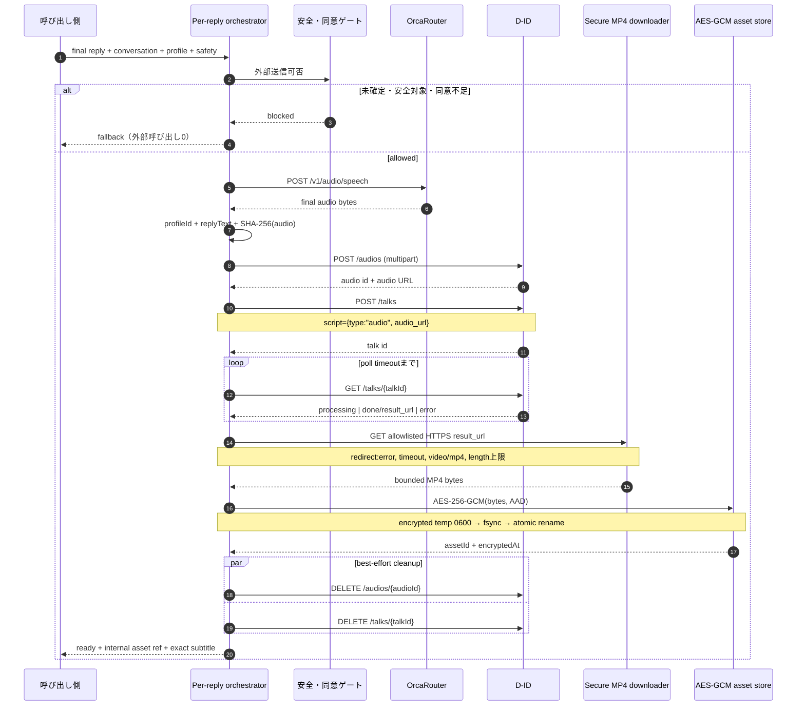

# 会話ごとの保護者写真口同期MP4・安全保存試作

## 1. 目的と隔離範囲

OrcaRouterで安全判定と返信文が確定した後、その最終文をOrcaRouter TTSで音声化し、登録済み保護者写真と最終音声をD-IDへ渡す。D-IDが返す完成URLはクライアントへ公開せず、許可済みHTTPS hostからMP4を検証取得し、AES-256-GCMで暗号化して内部asset参照へ変換する。

既存本体への統合、UI、asset配信endpoint、永続job database、実サービスへの有料呼び出しは対象外である。実装は `prototypes/per-reply-lipsync/`、設計文書は本ファイルだけに隔離する。

## 2. 実装方針

1. **返答確定境界:** `replyFinal: true`、`conversationId`、対象route、明示的安全許可を必須にする。
2. **外部送信前ゲート:** profile、写真承認、HTTPS/S3画像URL、未撤回の送信先別同意をTTS前に検査する。拒否時の外部呼び出しは0件。
3. **単一音声原本:** OrcaRouter `POST /v1/audio/speech` の最終bytesをD-ID `POST /audios` にmultipart送信し、`POST /talks` はAudioScriptを使う。
4. **二段重複排除:** TTS前はconversationを含むpreflight key、TTS後は必須の `profileId + replyText + SHA-256(audio bytes)` を確定job keyとする。assetは会話間で共有できても、返却する `conversationId` と継続情報は要求ごとに再構成する。
5. **安全なMP4取得:** URLは完全一致allowlistのHTTPS hostname、credentialなし、443のみ。fetchは `redirect: "error"`、timeout付き。HTTP成功、`video/mp4`、必須Content-Length、設定上限、stream実byte、宣言長一致を検査する。
6. **暗号化保存:** 32-byte明示注入鍵をAES-256-GCMに使用する。AADは `profileId`、`jobKey`、`contentType` の順序付きtuple。平文はメモリ内だけで、暗号envelopeを同一directoryの `0600` temporary fileへ書き、fsync、atomic rename、最終 `0600` を適用する。directory作成modeは `0700`。
7. **ready条件:** D-IDの `done` だけではreadyにしない。`downloading_and_encrypting` を経て暗号asset保存が確定した後だけreadyにする。
8. **内部返却契約:** D-ID URLではなく `/api/lipsync/assets/{assetId}`、`videoAssetId`、`encryptedAtRest: true`、暗号化時刻、完全一致の `subtitle`/`replyText`、`conversationId` とcontinuationを返す。
9. **外部cleanup:** asset保存後にD-ID audioとtalkを並行best-effort削除する。poll、download、暗号保存の失敗・timeoutでも、取得済みIDの範囲で両方を削除する。cleanup失敗はready/元エラーを上書きせず個別warningを返す。
10. **再生契約:** asset内MP4の音声だけを再生し、`playSeparateTts: false` で二重音声と口同期ずれを防ぐ。

## 3. 変更予定・実施ファイル一覧

すべて本試作用の新規ファイルで、既存アプリは変更しない。

| ファイル | 役割 |
|---|---|
| `docs/prototypes/per-reply-did-lipsync.md` | 方針、sequence、リスク、テスト計画 |
| `prototypes/per-reply-lipsync/README.md` | 安全な利用・test手順、TextScript代替案 |
| `prototypes/per-reply-lipsync/index.mjs` | 試作公開API |
| `src/errors.mjs` | 秘密を含まない型付きエラー |
| `src/orcarouter-tts-client.mjs` | OrcaRouter Audio Speech |
| `src/did-client.mjs` | D-ID audio/talk作成、poll、audio/talk削除 |
| `src/secure-mp4-downloader.mjs` | allowlist HTTPS MP4検証取得 |
| `src/encrypted-video-store.mjs` | AES-256-GCM、AAD、atomic encrypted file |
| `src/secure-video-asset-service.mjs` | downloaderと暗号storeの合成 |
| `src/safety-gate.mjs` | 安全・同意・conversation検査 |
| `src/request-key.mjs` | SHA-256、preflight/final key |
| `src/state-machine.mjs` | `downloading_and_encrypting` を含む状態機械 |
| `src/playback-policy.mjs` | MP4内音声だけを使う契約 |
| `src/orchestrator.mjs` | 全体制御、内部asset返却、cleanup |
| `test/clients.test.mjs` | OrcaRouter/D-ID HTTP契約mock |
| `test/secure-storage.test.mjs` | URL/MIME/size/timeout、暗号roundtrip、平文非保存 |
| `test/orchestrator.test.mjs` | ready条件、cleanup、字幕、conversation、重複排除 |

表内の `src/` と `test/` は `prototypes/per-reply-lipsync/` からの相対path。

### 本番統合時の変更予定ファイル

この試作は既存ファイルへ未接続である。mainへ取り込む判断後は、次を変更または新設する。

| 予定ファイル | 変更内容 |
|---|---|
| `server.mjs` | 返信確定後のper-reply job作成、status取得、認可付きasset配信、会話継続を接続 |
| `.env.example` | feature flag、TTS model/voice、D-ID result host allowlist、timeout、暗号鍵参照、保存先を追加 |
| `lib/providers/orcarouter.mjs` または新規TTS provider | `POST /v1/audio/speech` とusage/latency計測を追加 |
| `lib/providers/did-video.mjs` | `/audios`、AudioScript `/talks`、poll、audio/talk削除をper-reply契約へ拡張 |
| `lib/guardian-video-service.mjs` | 会話ごとの非同期job、provider reconciliation、cleanup retryを管理 |
| 新規 `lib/persistent-lipsync-store.mjs` | fingerprint unique制約、lease、状態履歴、暗号asset metadata、TTLを永続化 |
| `lib/persistent-guardian-sampling.mjs` | 写真revisionとD-ID image ID/URLをprofileへ束縛し、撤回時に削除 |
| `lib/providers/media.mjs` | generated MP4はembedded audioだけを許可し、別TTS/browser speechを禁止 |
| `public/app.js` | job polling、「ママが登録したおへんじを準備しているよ」、内部MP4再生、下部chat字幕、会話継続 |
| `public/index.html` / `public/styles.css` | 字幕を動画外へ移し、生成中・失敗・安全引き継ぎ状態を分離 |
| `test/server.test.mjs` / `test/providers.test.mjs` | 複数往復、安全route 0-call、同一job 1-call、timeout、字幕一致、二重音声禁止を追加 |

## 4. API・保存シーケンス



失敗・timeoutではreadyを返さず、既知のaudio/talk IDだけcleanupして `failed` または `timed_out` を返す。

## 5. 状態機械

```text
created
  -> blocked
  -> gated
     -> synthesizing
        -> audio_ready
           -> uploading_audio
              -> creating_talk
                 -> polling
                    -> downloading_and_encrypting
                       -> ready

synthesizing / uploading_audio / creating_talk / polling /
downloading_and_encrypting -> failed | timed_out
```

`ready` は暗号assetのatomic rename完了とbest-effort cleanup待機後にのみ記録する。

## 6. API契約

### OrcaRouter

- `POST https://api.orcarouter.ai/v1/audio/speech`
- Bearer認証、OpenAI互換JSON、binary audio
- 既定model `openai/gpt-4o-mini-tts`
- HTTPS、入力長、応答byte、timeoutを制限

### D-ID

- `POST /audios`: 6 MB以下のmultipart `audio`
- `POST /talks`: `source_url` と `script: {type:"audio", audio_url}`
- `GET /talks/{id}`: 上限付きpoll
- `DELETE /audios/{id}`: 一時audio削除
- `DELETE /talks/{id}`: 完成または失敗talk削除

`AudioScript` 自体は `audio_url` を参照するが、アプリ側で音声を公開する必要はない。第一案は、OrcaRouterのbinary音声をserver memoryで上限検査し、そのままD-IDの `POST /audios` へmultipart送信する方法である。D-IDが返した一時audio URLを直後の `/talks` に渡すため、localhost、tunnel、恒久公開URL、自前object storageは不要になる。

利用するD-ID機能が `audio_url` しか受け付けない場合だけ、private object storageへ暗号化した一時objectを置き、D-IDだけがGETできるHTTPS署名URLを発行する。TTLは生成timeoutより少し長い2〜5分、object keyは乱数、bucketは非公開、redirectなし、Content-Type固定、queryをlogへ残さず、job終了時に即時削除し、短いlifecycleも設定する。localhostはD-IDから到達できず、恒久URLは撤回・漏えい時の影響が大きいため採用しない。

保護者写真は登録時に一度だけD-IDの `POST /images` へmultipart送信し、同意とprofile revisionに束縛した一時image ID/URLを使う案を優先する。写真差し替え・同意撤回時は `DELETE /images/{id}` と内部暗号asset削除を実行する。

公式参照: [OrcaRouter TTS](https://www.orcarouter.ai/models/openai/gpt-4o-mini-tts)、[D-ID audio upload](https://docs.d-id.com/reference/upload-an-audio)、[D-ID image upload](https://docs.d-id.com/reference/upload-an-image)、[D-ID create talk](https://docs.d-id.com/reference/createtalk)、[D-ID delete audio](https://docs.d-id.com/reference/deleteaudio)、[D-ID delete talk](https://docs.d-id.com/reference/deletetalk)。

## 7. OrcaRouter TTS不可時のTextScript案

現在はTTS失敗時にfail-closedし、D-IDを呼ばない。別routeを正式に設ける場合は、D-ID TextScriptを使える。

```json
{
  "source_url": "https://approved.example/guardian.jpg",
  "script": {
    "type": "text",
    "input": "OrcaRouterで確定済みの返信文",
    "provider": {
      "type": "microsoft",
      "voice_id": "ja-JP-NanamiNeural"
    }
  }
}
```

このrouteではD-IDが別音声を合成するため、OrcaRouter音声hashを使う現行確定keyとは別契約が必要になる。また、汎用TTS voiceは登録写真の保護者本人の声ではない。親声再現を名乗らず、voice cloneを導入する場合は写真同意と分離した録音同意、本人確認、provider規約、撤回・削除、子ども向け表示を別途設計する。

## 8. 安全・プライバシー境界

- APIキー・AES鍵・保護者素材・会話本文・署名URLをGitやlogへ置かない。
- result URLはdownload入力として一時利用するだけで、orchestrator結果とasset envelopeには保存しない。
- allowlistは完全一致hostnameのみ。redirectを拒否し、redirect先を再判定する曖昧さを持ち込まない。
- Content-Lengthを必須にし、stream中も実byte上限を超えた時点でcancelする。
- AES-GCM AADにprofile/job/contentTypeを束縛し、別contextでの復号を認証失敗にする。
- 平文MP4をfileへ書かず、暗号envelopeだけを保存する。
- asset配信時は認証・認可・監査・Range request方針を別途実装する。
- AI生成映像であることを明示し、「保護者本人のリアルタイム映像・声」と誤認させない。

## 9. テスト計画

mockだけで次を自動検証する。

1. OrcaRouter Audio Speech payloadとbinary audio。
2. D-ID multipart、AudioScript、poll、audio/talk削除。
3. HTTPS exact host、redirect:error、Content-Type、Content-Length、宣言/実byte上限、timeout。
4. AES-256-GCM roundtrip、AAD不一致拒否、平文文字列・`.mp4`・temporary file非残存。
5. 安全routeと未確定replyで外部呼び出し0。
6. profile/text/audio hashでD-IDとasset保存を二重実行しない。
7. 暗号保存promise完了前はreadyにならず、D-ID URLを返さない。
8. ready/failed/timed_outと `downloading_and_encrypting` 履歴。
9. 成功・poll失敗・timeout・download/store失敗で可能なaudio/talk cleanup。
10. cleanup失敗がsecure ready assetまたは元エラーを上書きしない。
11. `subtitle === replyText` の完全一致とconversation別continuation。
12. MP4内音声のみを再生し、別TTS再生を禁止する。

```powershell
node --test prototypes/per-reply-lipsync/test/clients.test.mjs prototypes/per-reply-lipsync/test/secure-storage.test.mjs prototypes/per-reply-lipsync/test/orchestrator.test.mjs
```

## 10. 残リスク・本番化課題

- **persistent dedup:** 現在のregistryは単一process memory内で、再起動、複数worker、TTL、期限切れasset URLに対応しない。DB unique key、lease、outboxが必要。
- **persistent cleanup queue:** create request timeout後はprovider側だけtalkが作られID不明になる可能性がある。cleanup retry queue、provider一覧とのreconciliation、dead-letter監視が必要。
- **asset serving:** 復号配信endpoint、conversation/profile認可、Range、cache禁止、監査、削除APIは未実装。
- **key management:** KMS/HSM、key version、rotation、旧asset再暗号化、memory zeroizationは未実装。
- **Windows ACL:** Nodeの `0600` modeを設定するが、本番WindowsではNTFS ACLが期待通りかdeploymentで検証する。POSIXではtestでmodeを確認する。
- **DNS/egress:** hostname allowlistに加え、本番networkでprivate range遮断、egress proxy、DNS rebinding対策を行う。
- **MP4深層検査:** MIME/sizeだけでなく、ffprobe sandbox、codec/duration/audio track数、malformed container検査が必要。
- **profile revision:** 同じprofileIdで写真を差し替えると過去assetを再利用し得る。profileIdを写真revisionへ結び付けるか、承認後にrevisionをkeyへ追加する。
- **live未検証:** 実APIの課金、quota、CDN hostname、Content-Length、latency、品質は有料呼び出し禁止のため未検証。

## 11. 所要時間と優先順位

期限前の目標は、本番品質を装うことではなく、通常route 1往復と安全routeの実証、二重生成防止、原価計測を確実に見せることとする。

| 優先 | 作業 | 目安 | 完了条件 |
|---|---|---:|---|
| P0 | 既存serverへfeature flag付きでorchestratorを接続 | 2〜3時間 | demo modeを壊さずper-reply jobを開始できる |
| P0 | D-ID image/audio/talkのlive疎通を最小1〜3回実施 | 1〜2時間 | 口同期MP4、実latency、credit、CDN headerを記録 |
| P0 | UI polling、生成中表示、動画外字幕、embedded audio、会話継続 | 2〜3時間 | 通常会話を2往復し、別TTSが鳴らない |
| P0 | 安全route、timeout、重複クリック、同意撤回の回帰確認 | 2時間 | D-ID 0-call、安全表示、同一request 1-callを証拠化 |
| P0 | 3分デモ録画と提出用スクリーンショット | 1〜2時間 | 通常routeと安全routeを連続して見せる |
| P1 | 認可付き復号配信、Range、no-store、削除API | 3〜5時間 | 他profileから読めず、撤回で消える |
| P1 | DB unique/lease、cleanup queue、reconciliation | 4〜8時間 | 再起動・複数workerでも二重課金しない |
| P1 | KMS、key rotation、ffprobe、egress/DNS対策 | 1〜2日 | セキュリティ試験と運用手順を通す |

期限前P0は合計8〜12時間程度を見込む。実D-ID待ち時間とAPI差異で増えるため、現在の待機動画routeはfeature flagで残し、失敗時フォールバックとして明示する。ただし静止画・待機動画へのfallbackは今回の口同期必須要件を達成した扱いにはしない。

原価・価格・販売仮説は [`docs/submission/COST_AND_BUSINESS_PLAN.md`](../submission/COST_AND_BUSINESS_PLAN.md) を参照する。
