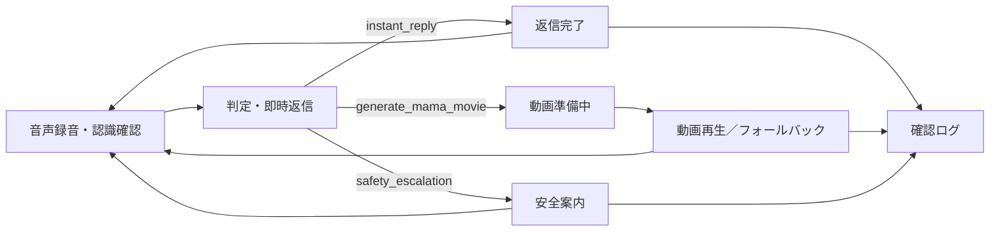
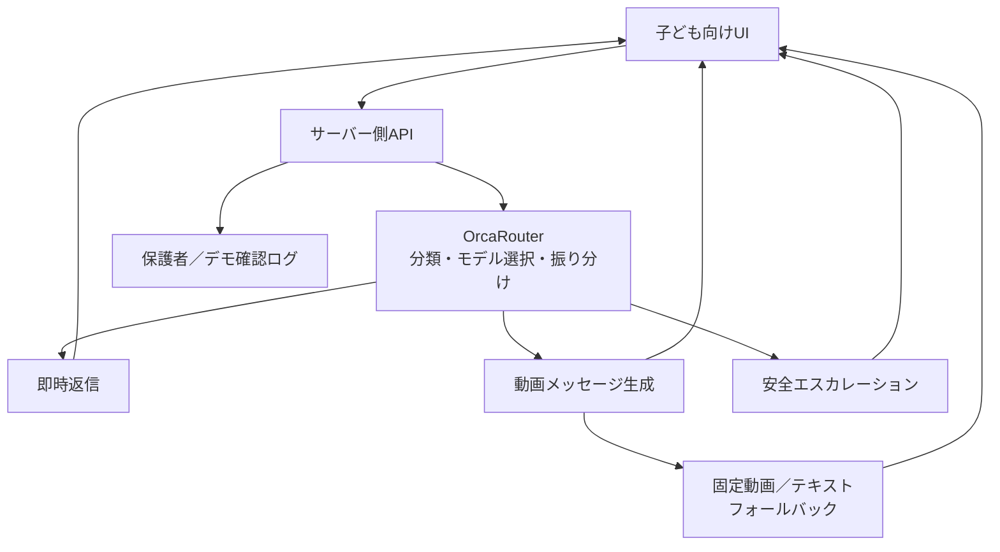

# 要件レビュー・チェックリスト（2名／10〜15分）

更新日: 2026-08-13  
対象: AI HACK 2026「AIビデオメッセージ」MVP  
参照: `docs/hackathon-build/prd.md` / `docs/team/TEAM_WORKFLOW.md` / `README.md`

## 0. レビューの進め方（1分）

- 最優先はフロントエンドの認識合わせです。まず下の「15分レビュー」だけを確認します。
- 意見が割れた項目だけ、後半の画面別詳細チェックで仕様を確認します。詳細項目をすべて埋める必要はありません。
- 各項目は問題なければチェックし、相違があれば末尾の回答欄に「項目番号・修正文」を記入します。
- 判定は `承認` / `修正` / `保留` のいずれかです。保留には決定者と期限を付けます。
- このレビューでは実装方法の詳細を決めず、子どもと審査員に見える体験、文言、安全性、MVP境界をそろえます。

## 0.1 フロントエンド優先・15分レビュー（必須）

### 体験の柱

- [ ] **R-00** 主対象は延長保育や一時預かりで保護者と長く会えない3〜6歳の未就学児で、保育士・ベビーシッターと一緒に「その場にいない保護者からのAIビデオメッセージ」を受け取る。
- [ ] **R-01** 子どもが短い音声を録音し、認識テキストを確認して送ると、まず温かいテキスト返信が返る。
- [ ] **R-02** 特別な出来事には、保護者同意済み素材を使った5〜8秒のAIビデオメッセージが届く。
- [ ] **R-03** 深刻・危険な発言では動画を作らず、信頼できる大人への相談を案内する。

### 入力画面

- [ ] **R-04** MVPの主入力は音声で、大きなマイクボタンをタップして録音開始、もう一度タップして停止できる。
- [ ] **R-05** 録音中は波形、経過時間、「きいているよ」が表示され、録音中だと子どもにも分かる。
- [ ] **R-06** 停止後は認識テキストを確認し、「おくる」「もういちど」を選べる。文章入力はデモ継続用フォールバックに限る。

### 出力と画面遷移

- [ ] **R-07** 基本遷移は「録音 → 認識テキスト確認 → 送信 → 即時返信 → 動画準備中 → 動画再生 → もう一度録音」である。
- [ ] **R-08** 通常会話では即時返信だけで完了し、不要な動画待機画面へ進まない。
- [ ] **R-09** 動画準備中は「ママからのメッセージを準備しているよ」と待つ理由を示す。
- [ ] **R-10** 完成画面では動画、短いテキスト、再生、もう一度見る、次の入力への操作が確認できる。
- [ ] **R-11** 動画が失敗しても固定動画またはテキストへ切り替わり、体験が途中で止まらない。

### 表現・安全・端末

- [ ] **R-12** 「本物のママが今話している」と誤認させず、AI生成と保護者同意済み素材の利用を明示する。
- [ ] **R-13** 安全案内は通常返信やエラーと見分けられ、次に相談する相手が具体的に分かる。
- [ ] **R-14** スマートフォン縦向きで、文字・入力欄・主要ボタン・動画が重ならず操作できる。
- [ ] **R-14A** 「駄々をこねる子を黙らせる」「AIに育児を任せる」ではなく、その場の保育士・ベビーシッターが子どもをあやし、寂しさに寄り添う際の気持ちの切り替え補助として説明する。

### デモと構成

- [ ] **R-15** 成功例・安全例・動画失敗例の3つを、設定画面を経由せず同じUIで再現できる。

必須項目で修正がある場合は、項目IDと希望する画面・文言・動きを末尾の回答欄へ記入してください。

## 1. 目的・体験の柱（1分）

- [ ] **P-1** 一文の目的は「子どもの特別な瞬間に、保護者同意済みの声・写真などをもとに、AIが短いビデオメッセージを届ける」で一致している。
- [ ] **P-2** 体験の柱は、①すぐ返す `Instant Mama`、②特別な瞬間に届ける5〜8秒の `Mama Movie`、③深刻な内容を大人につなぐ安全分岐、の3つである。
- [ ] **P-3** 本物の母親のリアルタイム会話や代替ではなく、保護者の想いをAIで届ける体験である。
- [ ] **P-4** デモ視聴者が「誰の何を解決するか」「AIをどこで使うか」「どこで安全側に切り替えるか」を3分以内に理解できる。

## 2. 対象ユーザー（30秒）

- [ ] **U-1 子ども:** 延長保育や一時預かりで保護者と長く会えず、寂しさや不安を感じている3〜6歳の未就学児。短い音声で気持ちを伝え、録音、確認、送信、再録音の次の操作が1画面で分かる。
- [ ] **U-2 操作補助者:** その場にいる保育士・ベビーシッター・一時預かりスタッフが必要に応じて操作を助け、届いたメッセージをきっかけに子どもをあやし、気持ちに寄り添う。
- [ ] **U-3 メッセージ提供者:** 仕事などですぐに応答できない保護者が声・写真などの素材利用を許可し、子どもの入力、AIの返答、分類・動画結果、安全対応を後から確認する。
- [ ] **U-4 審査員・デモ視聴者:** 成功例と安全例を見て、価値、OrcaRouterの役割、AI生成・保護者同意、フォールバックを理解する。

### 利用シチュエーション

- [ ] **U-5 主デモ:** 延長保育でお迎えを待つ子どもが、母親に会いたい寂しい気持ちを保育園の先生へ声で伝える。
- [ ] **U-6 展開例:** 保育園の延長保育、ベビーシッターによる一時預かり、保育施設で保護者と離れて長く過ごす時間を説明できる。

## 3. 5段階フローと画面遷移（2分）

1. **入力:** 子どもがマイクをタップして発話し、停止後に認識テキストを確認して送る。
2. **判定・即時返信:** OrcaRouterが3ルートへ分類し、まず短い返答を表示する。
3. **分岐:** 通常は返信完了、特別な発言は動画準備、安全対象は大人への相談案内へ進む。
4. **結果:** 完成動画またはフォールバックを表示・再生する。安全分岐では動画を生成しない。
5. **確認:** 入力、分類、返答、動画状態、安全状態、モデル・原価・レイテンシ・ルートを確認用ログに残す。

- [ ] **F-1** 上記5段階と3分岐で、成功例と安全例を最初から最後まで説明できる。
- [ ] **F-2** 戻る・もう一度送る操作で入力画面へ戻れ、デモを繰り返せる。
- [ ] **F-3** デモ中に設定画面や複雑な管理画面を経由しない。

## 4. 画面別フロントエンド確認（5〜7分・最優先）

| 画面 | 主な目的 | 主な遷移先 |
| --- | --- | --- |
| S1 子ども向け音声入力 | 発言を録音・確認・送信する | S2 判定中・即時返信 |
| S2 判定中・即時返信 | 待ち時間を埋め、3ルートの次処理へ進む | S1 / S3 / S5 |
| S3 Mama Movie準備中 | 動画生成の理由と進行を伝える | S4 動画再生・結果 / S1 |
| S4 動画再生・結果 | 動画またはフォールバックを表示する | S1 / S6 |
| S5 安全案内 | 信頼できる大人への相談を促す | S1 / S6 |
| S6 保護者／デモ確認ログ | 対応結果と技術証跡を確認する | 各シナリオ終了 |

### S1. 子ども向け音声入力画面

- [ ] **S1-1 入力形式:** 主導線は短い音声入力。文章入力は音声が使えない場合にデモを続けるためのフォールバックとしてのみ表示する。
- [ ] **S1-2 入力例:** 画面上に「ママに会いたい。お迎えまだ？」など、延長保育での寂しさを表す、個人情報を含まない発話例を表示する。
- [ ] **S1-3 操作:** 大きなマイクボタンがひと目で見つかり、1回目のタップで録音開始、2回目のタップで停止できる。
- [ ] **S1-4 録音状態:** 録音中は波形、経過時間、「きいているよ」を同時に表示し、停止操作を明確にする。
- [ ] **S1-5 確認・送信:** 停止後は音声認識したテキストを編集せず確認でき、「おくる」「もういちど」を選べる。送信後は二重送信を防ぐ。
- [ ] **S1-6 失敗時:** 音声権限拒否では「マイクをつかえるようにして、もういちどためしてね」、認識失敗では「うまくききとれなかったよ。もういちどおはなししてね」など、責めない文言と再試行操作を示す。
- [ ] **S1-7 AI明示:** 常設の補足として「ママが登録してくれた声や写真をもとに、AIがメッセージを作るよ」を読める位置に示す。

### S2. 判定中・即時返信画面

- [ ] **S2-1 待機表示:** 判定中は無反応に見えないアニメーションまたは進行表示と、「メッセージをかんがえているよ」などの文言を出す。
- [ ] **S2-2 即時返信形式:** 短いテキストを必ず表示し、子どもが内容を確認できる。
- [ ] **S2-3 成功例の表示:** 「ママに会いたくなったんだね。先生と何をして待つか決めようね」のように、気持ちを受け止め、同席する大人の関わりへつなげる。
- [ ] **S2-4 状態:** `判定中` / `即時返信済み` / `次の処理へ` が視覚的に区別できる。
- [ ] **S2-5 通常ルート:** `instant_reply` は動画待機へ進まず、返信と「もういちどおはなしする」操作で完了する。
- [ ] **S2-6 判断失敗:** 分類に失敗しても「おはなししてくれてありがとう」など一般的な短い返信を表示し、停止しない。

### S3. Mama Movie準備中画面

- [ ] **S3-1 遷移条件:** `generate_mama_movie` の場合だけ表示され、安全分岐からは遷移しない。
- [ ] **S3-2 表示文言:** 「ママからのメッセージを準備しているよ」と、待つ理由が子どもに分かる。
- [ ] **S3-3 待機状態:** スピナー等だけにせず、`準備中` が文字でも分かる。長引いても画面が固まったように見えない。
- [ ] **S3-4 待機中操作:** 同じ送信を重ねない。必要なら「やめる」または入力画面へ戻る操作を明確にする。
- [ ] **S3-5 タイムアウト:** 規定時間を超えたら自動でフォールバックへ移り、技術用語やエラーコードを子どもに見せない。
- [ ] **S3-6 AI明示:** 「保護者が許可した素材を使ったAIビデオメッセージ」であると、この画面または次画面で確認できる。

### S4. 動画再生・結果画面

- [ ] **S4-1 出力形式:** 5〜8秒程度の短い動画をアプリ内プレーヤーで表示する。
- [ ] **S4-2 再生操作:** 大きな再生／一時停止、再生し直す操作があり、端末の自動再生制限があっても開始できる。
- [ ] **S4-3 表示文言:** 動画の前後に、内容に合った励まし・共感を短いテキストでも確認できる。
- [ ] **S4-4 AI生成表示:** 「AIが保護者の許可した素材をもとに生成しました」等を、動画を邪魔しないが見落とさない位置に表示する。
- [ ] **S4-5 完了状態:** `完成` と分かり、「もういちど見る」「もういちどおはなしする」を選べる。
- [ ] **S4-6 再生エラー:** 動画が読み込めない場合は固定動画、それも不可ならテキストへ切り替え、成功体験を中断しない。
- [ ] **S4-7 誤認防止:** 「今、本物のママが話している」「ママ本人がリアルタイムで返事している」と受け取れる表示を使わない。

### S5. 安全案内画面

- [ ] **S5-1 入力例:** デモ用の深刻な不安・危険を示すサンプルは、実在の子どもの情報を含まず、過度に刺激的でない。
- [ ] **S5-2 分岐:** `safety_escalation` では保護者からの動画を生成・表示せず、不在の保護者になりきった返答もしない。
- [ ] **S5-3 表示文言:** 「その場にいる先生やシッターさんに相談してね」のように、次の行動を短く具体的に示す。
- [ ] **S5-4 表現:** 「大丈夫」と断定せず、医療・心理・緊急事案をAIだけで判断・解決しない。
- [ ] **S5-5 状態:** 通常返信や一般エラーと見分けられ、保護者の確認が必要な状態だと分かる。
- [ ] **S5-6 緊急時:** 地域の緊急窓口などへの相談を妨げない表現にする。具体的窓口を出す場合は対象地域を明確にする。

### S6. 保護者／デモ確認ログ

- [ ] **S6-1 表示項目:** 子どもの入力、`route`、即時返信、動画状態、安全メッセージを確認できる。
- [ ] **S6-2 動画状態:** `pending` / `completed` / `fallback` / `failed` を区別できる。
- [ ] **S6-3 技術証跡:** 選択モデル、原価、レイテンシ、ルート、ステータスを審査員に見せられる。
- [ ] **S6-4 安全ログ:** `safety_escalation` は見落としにくい強調と「要確認」状態を持つ。
- [ ] **S6-5 情報制限:** 子ども向け画面には管理情報を出さず、ログにもAPIキー、保護者素材、不要な生データを表示しない。
- [ ] **S6-6 MVP代替:** 本格的な保護者画面を作らない場合、デモ用確認パネルで同じ確認事項を満たす。

## 5. 横断UI・モバイル・表現（1〜2分）

- [ ] **X-1 モバイル想定:** スマートフォン縦向きを基準に、録音中の波形・経過時間・停止操作、フォールバック時のキーボード、動画の縦幅、スクロール後の主要操作を確認する。
- [ ] **X-2 操作性:** ボタンや入力欄は小さすぎず、主要操作を片手でも押せる。文字だけでなく形・ラベルでも状態を区別する。
- [ ] **X-3 状態の一貫性:** `待機中` / `成功` / `フォールバック` / `失敗` / `安全対応` を色と短い文言の両方で区別する。
- [ ] **X-4 子ども向け表現:** 短いひらがな中心の文、責めない言い方、過度な断定を避けた温かい表現になっている。
- [ ] **X-5 失敗時の安心:** 「API」「タイムアウト」「ルーティング」等の技術語を子どもに見せず、次にできる操作を必ず示す。
- [ ] **X-6 AI・同意の明示:** 子どもにも読める説明と、審査員・保護者向けの正確な説明を両立する。
- [ ] **X-7 個人情報:** デモではサンプルデータだけを使い、実在の子どもの発言、音声、顔、氏名等を表示しない。

## 6. 概念レベルの構成とOrcaRouter（1分）

- [ ] **A-1** OrcaRouterは動画生成器ではなく、入力の意味に応じて `instant_reply` / `generate_mama_movie` / `safety_escalation` を判断し、適切なAI処理へ振り分ける役割である。
- [ ] **A-2** OrcaRouterは実処理に組み込み、分類・返信での接続設定またはモデル・ルート・原価・レイテンシのログを証跡として示す。
- [ ] **A-3** APIキーと保護者素材はクライアントや公開リポジトリへ出さない、という概念レベルの境界で合意している。
- [ ] **A-4** 動画APIが失敗しても、固定動画またはテキストへ切り替えてデモを完走する。

## 7. MVP範囲（1分）

### MVPに含める

- [ ] **M-1** 音声の録音・停止・波形・経過時間・認識テキスト確認・再録音、OrcaRouterの3分類、短い即時テキスト返信。文章入力はデモ継続用フォールバックのみ。
- [ ] **M-2** 特別な発言から待機表示を経て、5〜8秒動画または固定動画フォールバックを再生する流れ。
- [ ] **M-3** AI生成・保護者同意済み素材の明示、会話／処理ログ、安全対応表示。
- [ ] **M-4** 成功シナリオと安全シナリオを、デモ環境で繰り返し再現できること。

### MVPに含めない

- [ ] **M-5** 完全なリアルタイム映像会話、本物の母親が現在話しているように見せる機能。
- [ ] **M-6** 複数施設・複数保護者プロフィール向けの本格アカウント、課金、複雑な権限管理。
- [ ] **M-7** 長時間動画、複雑な編集、複数キャラクター。
- [ ] **M-8** 医療・心理・緊急事案をAIだけで判断・解決する機能。
- [ ] **M-9** 保育園内で子どもだけが自由に利用する形。保育士等の同席と保護者同意を必須とする。

## 8. デモ完成条件（1分）

- [ ] **D-1 成功例:** 延長保育でお迎えを待つ子どもが、保育園の先生同席で母親に会いたい寂しい気持ちを音声で伝え、マイクをタップ→発話→停止→認識テキスト確認→「おくる」→即時返信→準備中→Mama Movie再生→ログ確認を最初から最後まで再現できる。
- [ ] **D-2 安全例:** 深刻な内容を音声入力→認識テキスト確認→安全案内→動画非生成→保護者要確認ログを再現できる。
- [ ] **D-3 障害例:** 動画APIの失敗またはタイムアウト時も、固定動画またはテキストで完走できる。
- [ ] **D-4 説明:** AI生成、保護者同意、OrcaRouterの実利用、モデル・原価・レイテンシ・ルートを3分デモ内で説明できる。
- [ ] **D-5 再現性:** モバイル相当の画面で2シナリオを連続実行しても、表示崩れ、二重送信、前回状態の残留がない。

## 9. 確定済み仕様と未決事項

### 確定済み仕様

| ID | 決定内容 | 状態 |
| --- | --- | --- |
| Q-2 | 子どもの主入力は音声。大きなマイクボタンで録音開始・停止し、録音中は波形・経過時間・「きいているよ」を表示する。停止後は認識テキストを確認して「おくる」「もういちど」を選ぶ。権限拒否・認識失敗は子ども向け文言で再試行を案内し、文章入力はデモ継続用フォールバックに限る。 | 確定 |

### 未決事項（残り2点を決める）

| ID | 決めること | 推奨する仮置き | 決定 | 決定者／期限 |
| --- | --- | --- | --- | --- |
| Q-1 | 動画生成APIを本番利用するか、固定動画を主にしてAPI利用を見せるか | デモ再現性を優先し、固定動画フォールバックを常備 |  |  |
| Q-3 | 保護者ログ画面を実装するか、デモ用確認パネルで代替するか | 簡易確認パネルで代替する |  |  |

追加の未決事項が出た場合は、MVP追加にせず、まず以下へ記録します。

| ID | 論点 | 選択肢／修正案 | 決定者 | 期限 |
| --- | --- | --- | --- | --- |
| Q-4 |  |  |  |  |
| Q-5 |  |  |  |  |

## 10. 担当者ごとの回答欄（1分）

### レビュアーA（体験・安全）

- 判定: [ ] 承認　[ ] 修正　[ ] 保留
- 修正／保留の項目ID:
- 修正文または判断に必要な情報:
- 回答者:
- 回答日時:

### レビュアーB（伝達・提出）

- 判定: [ ] 承認　[ ] 修正　[ ] 保留
- 修正／保留の項目ID:
- 修正文または判断に必要な情報:
- 回答者:
- 回答日時:

### 統合結果（主レビュアーまたは決定者）

- 最終判定: [ ] 承認　[ ] 修正後承認　[ ] 保留
- 採用する修正:
- 保留事項の決定者／期限:
- 次の実装へ進める条件:
