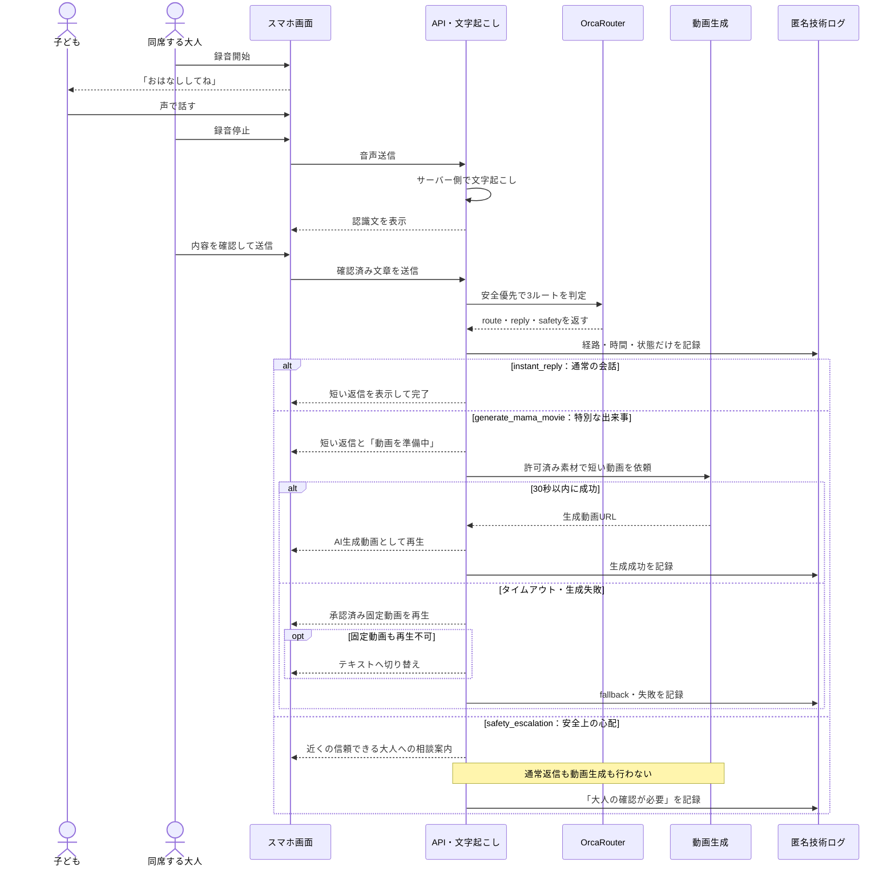

# AI HACK 2026 処理シーケンス図

## 図の前提

- 主な利用場所は家庭で、3〜6歳児と同席する大人が使う。
- スマホ操作は同席する大人が行い、子どもの主入力は音声とする。
- 本物の保護者とのリアルタイム通話ではなく、AIによる応答であることを画面上で示す。
- 生音声と会話本文は技術ログへ残さず、匿名ID・route・model・cost・latency・statusのみを記録する。
- 安全ルートでは保護者になりきらず、通常返信と動画生成を止める。
